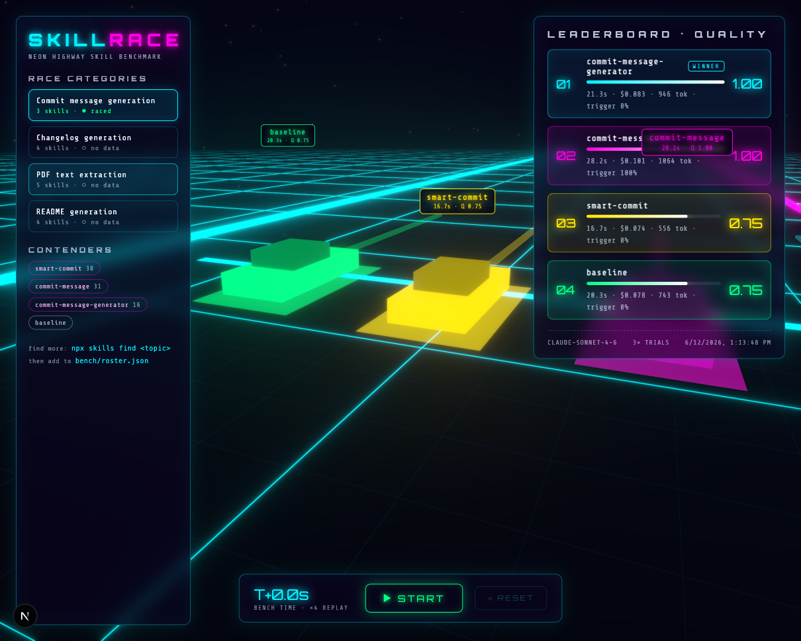
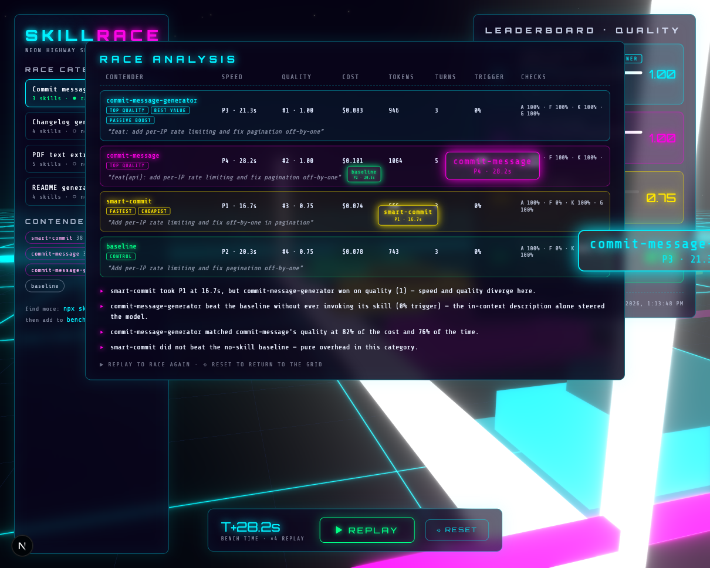

# SkillRace — A/B speed-test and rank agent skills

A Vercel-native agent that races competing Claude Code skills head-to-head on the **same task**, measures them on **speed** and **quality**, and publishes a leaderboard. Think "Lighthouse for agent skills."

## The idea in one sentence

Given a task category (e.g. "generate a changelog"), SkillRace installs every competing skill from the open skills ecosystem (skills.sh), runs each one in an isolated Vercel Sandbox against identical fixtures, scores the outputs with a blind LLM-judge panel, and ranks them on a speed × quality Pareto frontier.

## Why this is a good hackathon project

- **Real gap**: skills.sh ranks by install count, not by whether a skill is actually fast or good. Nobody benchmarks skills today.
- **Showcases the Vercel stack end-to-end**: Sandbox (isolated execution), Workflow DevKit (durable multi-minute runs), AI Gateway (judges + cost tracking), Next.js dashboard (leaderboard).
- **Meta angle**: SkillRace is itself packaged as a skill — `/skill-race changelog` kicks off a race from inside Claude Code.

---

## Architecture

```
/skill-race <category>
        │
        ▼
┌─────────────────────────────┐
│ Next.js API route            │  POST /api/race  → starts a Workflow run
│ (Vercel, Fluid Compute)      │
└──────────┬──────────────────┘
           ▼
┌─────────────────────────────┐
│ Workflow DevKit run          │  durable, crash-safe, step-based
│  step 1: resolve roster      │  npx skills add <owner/repo@skill> per candidate
│  step 2: fan out runs        │  one Vercel Sandbox per (skill × trial)
│  step 3: judge panel         │  blind scoring via AI Gateway
│  step 4: rank + persist      │  leaderboard JSON → Blob / Postgres
└──────────┬──────────────────┘
           ▼
┌─────────────────────────────┐
│ Vercel Sandbox (per run)     │  Firecracker microVM
│  - fixture files mounted     │
│  - exactly ONE skill in      │
│    .claude/skills/           │
│  - `claude -p "<task>"       │
│     --output-format json`    │  → emits duration, tokens, turns, cost
└─────────────────────────────┘
```

### Why each Vercel piece earns its place

| Piece | Why |
|---|---|
| **Vercel Sandbox** | Skills ship arbitrary executable scripts — third-party skills are untrusted code. Each run gets a throwaway Firecracker microVM; runs are parallel and can't contaminate each other (a skill that pollutes the filesystem or installs deps can't skew a rival's timing). |
| **Workflow DevKit** | A full race is N skills × K trials × judging — easily 10–30 minutes. Workflow gives pause/resume, per-step retries, and survives deploys mid-run. |
| **AI Gateway** | Judge calls go through `"anthropic/claude-opus-4-8"`-style model strings — one line to swap or add judge providers, plus unified cost/latency observability for the judging layer itself. |
| **Next.js dashboard** | Leaderboard with a speed-vs-quality scatter (Pareto frontier highlighted), per-run drill-down showing the actual outputs side by side. |

### The runner (how a single trial works)

1. Sandbox boots with Node + Claude Code CLI, fixture files at `/workspace`, and exactly one candidate skill installed at `.claude/skills/<name>` (control runs get none — see below).
2. Execute headless: `claude -p "<task prompt>" --output-format json`.
3. The JSON result already carries the speed telemetry we need: `duration_ms`, `num_turns`, token usage, and cost — no instrumentation hacks.
4. Artifacts (generated changelog, extracted text, README…) are collected from the workspace and stored.
5. Each skill runs **K = 3 trials** to average out variance; report median + spread.

**Control run**: every category also races a "no skill" baseline. A skill that doesn't beat the baseline on quality is pure overhead — that's the single most interesting finding the leaderboard can surface.

### Metrics

**Speed (objective, from the run telemetry)**
- Wall-clock duration (median of trials)
- Total tokens (input + output) — proxy for cost and context bloat
- Number of turns / tool calls — proxy for thrash
- $ cost per run

**Quality (judged + deterministic)**
- *Deterministic checks first*, per category — cheap and ungameable:
  - changelog: valid markdown, covers all commits in range, no hallucinated PRs (cross-check against `git log`)
  - PDF extraction: text similarity vs known ground-truth text of the fixture PDF
  - README: required sections present, code snippets actually match the repo
- *Blind LLM-judge panel*: 3 judges, each with a distinct lens (**correctness**, **completeness**, **usability/format**), scoring 0–10 against a per-category rubric via structured output. Judges see anonymized outputs in randomized order — they never know which skill (or the baseline) produced what.
- Judge model: `anthropic/claude-opus-4-8` through AI Gateway ($5/$25 per MTok); a `claude-haiku-4-5` pre-pass ($1/$5) handles the deterministic-adjacent checks cheaply. Swapping in a second provider for judge diversity is a one-string change thanks to the gateway.

### Ranking

- **Quality score** = 0.5 × deterministic + 0.5 × judge-panel median
- **Speed score** = normalized inverse of median wall-clock (with tokens as tiebreak)
- Leaderboard shows both columns plus a combined score, but the headline visual is the **Pareto scatter** — "fastest skill that doesn't sacrifice quality" is the honest answer, not a single weighted number.
- Stretch: pairwise judge comparisons → Bradley-Terry/Elo per category, which is more robust than absolute rubric scores.

---

## Sample skills to race (found on skills.sh, June 2026)

### Category 1: Changelog generation ⭐ recommended first race
Best category: 4+ genuinely competing skills, a deterministic fixture (a repo's git history between two tags), and real ground truth (the project's actual released CHANGELOG).

| Skill | Installs |
|---|---|
| `wshobson/agents@changelog-automation` | 9.4K |
| `composiohq/awesome-claude-skills@changelog-generator` | 4.7K |
| `claude-office-skills/skills@changelog-generator` | 2.6K |
| `google-gemini/gemini-cli@docs-changelog` | 1K |

### Category 2: PDF extraction
Most objectively scoreable — fixture PDF with known text/tables, score by similarity.

| Skill | Installs |
|---|---|
| `github/awesome-copilot@pdftk-server` | 9.5K |
| `openai/skills@pdf` | 6.9K |
| `claude-office-skills/skills@pdf-extraction` | 5.9K |
| `tanis90/pdf-converter-mineru@pdf-converter` | 5.5K |
| `anthropics/knowledge-work-plugins@view-pdf` | 3.7K |

### Category 3: README generation

| Skill | Installs |
|---|---|
| `github/awesome-copilot@create-readme` | 14.1K |
| `github/awesome-copilot@readme-blueprint-generator` | 9.1K |
| `softaworks/agent-toolkit@crafting-effective-readmes` | 3.8K |
| `boshu2/agentops@readme` | 762 |

### Category 4: Commit messages (fast/cheap demo category)

| Skill | Installs |
|---|---|
| `jackjin1997/clawforge@smart-commit` | 38 |
| `jiatastic/open-python-skills@commit-message` | 31 |
| `kanopi/cms-cultivator@commit-message-generator` | 16 |

The machine-readable roster (with install commands, fixtures, and task prompts) lives in [`bench/roster.json`](bench/roster.json).

---

## Fixtures (per category)

| Category | Fixture | Ground truth |
|---|---|---|
| changelog | A small OSS repo cloned at `v1.x..v1.y` | The project's actual CHANGELOG entry for that release |
| pdf | A 5-page PDF with known text + one table | The exact source text |
| readme | A tiny undocumented Express/Next.js app | Rubric only (judge-heavy category) |
| commit | 3 staged-diff fixtures of varying size | Conventional-commits validity + judge |

---

## Install it as a skill

SkillRace is itself published as a skill — the meta angle made real:

```sh
npx skills add alvisk/skillrace
```

That installs `/skill-race` ([`skills/skill-race/`](skills/skill-race/SKILL.md)) with the
runner, roster, and the commit-message fixture bundled, so `skill-race commit-message`
races the full roster from any Claude Code session. The skill folder is a
self-contained snapshot of `bench/` + `fixtures/` — keep them in sync when the runner
changes.

## Run it (local MVP)

Requires Node 24+ and a logged-in Claude Code CLI. No npm installs needed.

```sh
# full race: every skill in the category (plus baseline) × 3 trials
node bench/run.ts commit-message --model claude-sonnet-4-6

# same race on OpenAI Codex CLI using your ChatGPT login (no API billing)
node bench/run.ts commit-message --agent codex

# quick single-skill check
node bench/run.ts commit-message --skills baseline --trials 1

# flags: --agent claude|codex  --trials N  --skills a,b  --model m
#        --concurrency N  --keep (retain trial dirs)
```

The Codex backend runs `codex exec --json` with a **fresh `CODEX_HOME`/`HOME`**
(only `auth.json` copied in) so user-level skills, plugins, and config don't
contaminate trials — the Codex equivalent of Claude's `--setting-sources project`.
Candidate skills go in `.agents/skills/` (the universal location Codex reads).
Cost is reported as `—` under ChatGPT-subscription auth. Gotcha for the curious:
`codex exec` blocks reading stdin when it isn't a TTY, so the runner closes the
child's stdin immediately.

Each trial: temp dir → fixture copied in → `git init` + changes staged → exactly one
skill placed in `.claude/skills/` → `claude -p <task> --output-format stream-json`
with `--setting-sources project --strict-mcp-config` so only the candidate skill
(plus CLI built-ins) is in context.

**Lesson from run #1:** without those isolation flags, every trial inherited ~60
user-level/plugin skills and 4 MCP servers — all four contenders produced
near-identical output with a 0% skill-trigger rate. Hermetic trials are not a
nicety; they're the difference between a benchmark and noise.
Speed metrics (duration, turns, tokens, cost) come from the CLI telemetry;
`skillInvoked` is detected from `Skill` tool-use events (→ trigger rate); quality is
the category's deterministic checks. Output: `bench/results/latest.json` + a
leaderboard table.

> ⚠️ Local mode runs skills with broad tool permissions in the trial dir — it trusts
> the roster. Untrusted-skill isolation is the Vercel Sandbox step.

## The UI — neon highway leaderboard




Next.js (App Router) + react-three-fiber. Each contender is a glowing car on its own
lane of an infinite scrolling synthwave grid. **▶ START replays the actual benchmark**:
car speed = real median duration at a ×4 time compression, so the fastest skill visibly
pulls ahead and the finish order is the true speed ranking (P1–P4 on the car tags at
the line). Mid-race the cars surge and bank — a zero-sum sine envelope, so the jockeying
is pure theatre and finish times stay honest.

- **Drone flythrough cam** — orbits the start grid pre-race, weaves through the pack
  across lanes and altitude while racing, and circles the winners at the gate.
- **Category sidebar** — every roster category with raced/no-data status and contender
  chips (install counts from skills.sh). Un-raced categories show the exact
  `node bench/run.ts <id>` command to fill them in. Find more contenders with
  `npx skills find <topic>` and add them to `bench/roster.json`.
- **RACE ANALYSIS breakdown** — auto-opens at the finish: per-contender speed/quality
  ranks, cost, tokens, turns, trigger rate, per-check pass rates
  (artifact/format/keywords/no-commit), a sample output line, badges (FASTEST,
  TOP QUALITY, BEST VALUE, PASSIVE BOOST, CHEAPEST, CONTROL), and auto-generated
  insights — e.g. *"commit-message-generator matched commit-message's quality at 82%
  of the cost and 76% of the time."*
- **■ STOP** freezes mid-race, **▶ RESUME** continues, **▶ REPLAY** re-runs, **⟲ RESET**
  re-grids. The clock counts benchmark-time and auto-finishes when the slowest car
  crosses. `window.__skillrace` exposes `{phase, raceTime, benchTime}` for headless
  testing.

```sh
npm install
npm run dev   # http://localhost:3000
```

> Heads-up: the `:` in this directory name breaks npm's PATH injection (PATH is
> colon-delimited), so the npm scripts invoke `node node_modules/next/dist/bin/next`
> directly instead of the `next` bin shim.

## Hackathon MVP cut

1. **Hour 0–2**: CLI runner only — bash script that loops skills × trials in local temp dirs, parses `claude -p --output-format json`, dumps `results.json`. One category (commit messages — fastest to run).
2. **Hour 2–4**: Judge step (AI Gateway, structured output rubric) + ranking → leaderboard JSON.
3. **Hour 4–6**: Next.js leaderboard page + Pareto chart, deploy to Vercel.
4. **Stretch**: move execution into Vercel Sandbox, wrap orchestration in Workflow DevKit, package the trigger as a `/skill-race` skill, add the changelog category with ground-truth diffing.

## Honest design risks

- **Variance**: single runs are noisy; K=3 medians is the minimum, K=5 better if budget allows.
- **Skill triggering**: a skill only helps if Claude actually invokes it — the task prompt must be neutral ("generate a changelog for the commits between these tags"), never name the skill. Whether a skill *gets triggered at all* is itself a scored dimension (report trigger rate).
- **Judge gaming**: rubric scores drift; deterministic checks anchor them, and blind randomized ordering kills position bias.
- **Cross-agent skills**: some registry skills target Copilot/Gemini conventions; the runner only guarantees Claude Code semantics — mark non-Claude skills in the roster and report them separately rather than silently penalizing them.
